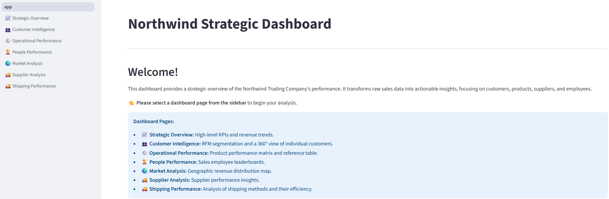
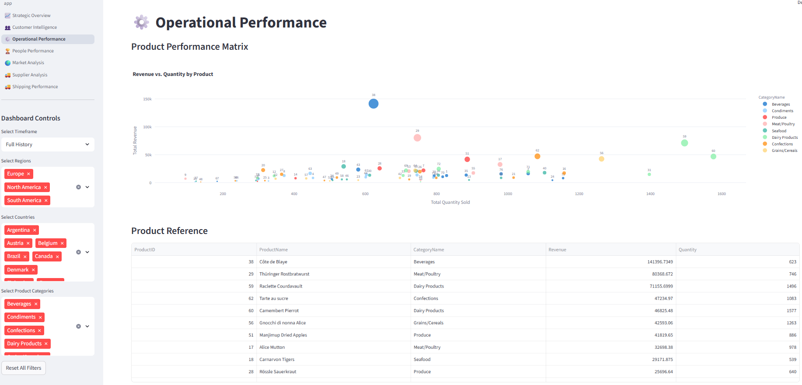

# Northwind Strategic Dashboard

This project is a strategic BI dashboard for the Northwind sample database. It transforms raw sales data into actionable insights, focusing on customers, products, suppliers, and employees.

### Key Features

- **Multi-Page App Structure**: A clean, scalable, and intuitive navigation experience.
- **Stateful Cross-Filtering**: Interactively filter the dashboard by timeframe, region, country, or category.
- **Strategic Overview**: High-level KPIs and revenue trends.
- **Customer Intelligence**: RFM segmentation and a 360° view of individual customers.
- **Operational & Supplier Performance**: Product performance matrix and reference table.
- **People Performance**: Leaderboards for sales employees.
- **Market Analysis**: An interactive choropleth map to visualize revenue distribution.
- **Supplier Analysis:** Supplier performance insights.
- **Shipping Performance:** Analysis of shipping methods and their efficiency.

## Table of Contents
- [The Northwind Database](#the-northwind-database)
- [Data Architecture](#data-architecture)
- [Prerequisites](#prerequisites)
- [Installation and Setup](#installation-and-setup)
- [Running the Application](#running-the-application)
- [Project Structure](#project-structure)
- [Testing](#testing)
- [Dashboard Screenshots](#dashboard-screenshots)
- [Future Work & Enhancements](#future-work--enhancements)

## The Northwind Database

The Northwind database is a classic sample database from Microsoft that models the sales data of a fictional gourmet food supplier. It includes tables for customers, orders, products, suppliers, and more. This relational structure is ideal for demonstrating real-world analytics scenarios.

For a visual representation of the database schema, please see the entity relationship diagram located in the `docs/` folder.

## Data Architecture

This project uses a simple and efficient **in-memory ETL architecture**. The entire data pipeline is orchestrated by Python and executed when the Streamlit application starts.

```mermaid
graph TD
    A[SQL Server Database] -- 1. Extract --> B{Python Application <br> (Running in Docker)};
    B -- 2. Transform in Memory --> B;
    B -- 3. Load to UI --> C[User's Web Browser];
```

1.  **Extract**: The Python script connects directly to the external **SQL Server (Northwind) database**. Raw tables are extracted into pandas DataFrames.
2.  **Transform**: The raw DataFrames are processed **entirely in memory**. The `etl/transform.py` script merges tables, calculates new metrics (like Revenue and Shipping Time), and performs analyses to create a single, clean, analysis-ready DataFrame.
3.  **Load**: The final, transformed DataFrame is passed directly to the **Streamlit front-end** and cached for the user's session, ensuring fast filtering and interaction.

This lightweight architecture is highly effective for the scale of the Northwind dataset, providing excellent performance without the need for a separate data warehouse.

### The Role of Docker

Docker is used to **containerize the Python application**, packaging all its code, dependencies, and configurations into a single, portable unit called an image.

The primary purpose of using Docker here is to ensure **consistency and reproducibility**. Anyone can build and run the application with a single command, regardless of their local operating system or Python setup.

-   It **DOES** create a self-contained environment for the Streamlit app.
-   It **DOES NOT** run the SQL Server database. The containerized application still connects to your external SQL Server instance over the network. This is why the `.env` file is required to provide the database credentials to the app inside the container.                                                                                                 |

## Prerequisites

You can run this project in two ways: locally using a Python environment, or with Docker.

### For Local Development
- **Python 3.9+**
- **Git**
- **SQL Server**: An accessible instance with the Northwind database installed.

### For Running with Docker (Recommended)
- **Docker Desktop**: An easy-to-install application for Mac, Windows, or Linux that provides the Docker Engine.
- **SQL Server**: An accessible instance for the container to connect to.

## Installation and Setup

### 1. Clone the Repository

```bash
git clone <repository-url>
cd northwind-analytics
```

### 2. Set Up Your Python Environment

You can use a standard Python virtual environment or Anaconda/Miniconda.

**Option A: Standard `venv`**

```bash
# Create a virtual environment
python -m venv venv

# Activate it
# On Windows:
venv\Scripts\activate
# On macOS/Linux:
source venv/bin/activate
```

**Option B: Anaconda / Miniconda**

```bash
# Create a new conda environment
conda create --name northwind_env python=3.9

# Activate it
conda activate northwind_env
```

### 3. Install Dependencies

With your environment activated, install the required Python packages.

```bash
pip install -r requirements.txt
```

### 4. Configure the Database Connection

The application connects to your database using credentials stored in a `.env` file. This file is ignored by Git to keep your secrets safe.

**A. Create the `.env` file:**

Copy the example file to create your local configuration:

```bash
# On Windows:
copy .env.example .env
# On macOS/Linux:
cp .env.example .env
```

**B. Configure Connection Settings:**

Open the new `.env` file and fill in the details for your SQL Server instance.

-   `DB_SERVER`: The address and port of your SQL Server instance.
    -   **For a local named instance (like SQLEXPRESS)**: You must use a **static port**. Find the port in **SQL Server Configuration Manager** under `TCP/IP Properties -> IPAll`. A common choice is `1434`. The format should be `localhost:1434`.
    -   **For a default instance**: This is often just `localhost` or `localhost:1433`.
-   `DB_DATABASE`: The name of the database (e.g., `Northwind`).
-   `DB_USERNAME` & `DB_PASSWORD`: 
    -   For **Windows Authentication**, leave these blank.
    -   For **SQL Server Authentication**, fill in your specific username and password.

*Example for a local SQLEXPRESS instance on port 1434 using Windows Authentication:*
```dotenv
DB_SERVER=localhost:1433
DB_DATABASE=Northwind
DB_USERNAME=
DB_PASSWORD=
```

## Running the Application

Once everything is configured, run the Streamlit app from your terminal:

```bash
streamlit run app.py             # option 1
python -m streamlit run app.py   # option 2
```

Your web browser should open with the dashboard at `http://localhost:8501`.

## Project Structure

```
. 
├── app/                                    # Main application source code
│   ├── etl/                                # ETL pipeline modules
│   │   ├── extract.py
│   │   ├── transform.py
│   │   ├── load.py
│   │   └── utils.py                        # Utility functions and data mappings for the ETL process
│   ├── ui/                                 # Shared UI components between pages
│   │   └── shared_components.py
│   ├── config.py                           # Environment variable handler
│   └── main.py                             # ETL orchestrator
├── docs/                                   # Documentation (ERD and instnwnd.sql)
├── pages/                                  # Streamlit pages for the multi-page app
│   ├── 1_📈_Strategic_Overview.py
│   ├── 2_👥_Customer_Intelligence.py
│   ├── 3_⚙️_Operational_Performance.py
│   ├── 4_🏆_People_Performance.py
│   ├── 5_🌍_Market_Analysis.py
│   ├── 6_🚚_Supplier_Analysis.py
│   └── 7_🚚_Shipping_Performance.py
├── tests/                                  # Unit test
│   ├── conftest.py
│   └── test_transform.py
├── .env.example                            # Example environment file
├── .gitignore
├── app.py                                  # Streamlit entry point (Landing Page)
├── Dockerfile                              # Tells Docker how to build the application image
├── LICENSE
├── README.md
└── requirements.txt                        # Python package dependencies
```

## Testing

This project includes a robust unit test suite to guarantee the integrity and correctness of the core data transformation logic. The tests are designed to be fast, reliable, and do not require a database connection.

### Purpose of the Tests

The primary goal of the test suite is to validate the `create_comprehensive_sales_data` function in `app/etl/transform.py`. This function is the heart of the ETL pipeline, responsible for merging multiple data sources and enriching the data.

The tests verify several key outcomes:
- **Correct Calculation:** Ensures that new columns, like `Revenue`, are calculated accurately based on the business logic (e.g., `UnitPrice * Quantity * (1 - Discount)`).
- **Successful Merging:** Confirms that data from different sources (customers, employees, suppliers, etc.) is joined correctly, creating enriched columns like `EmployeeName`.
- **Data Enrichment:** Validates that new information, such as the `Region` and `CountryISO3` columns, is mapped correctly to the source data.
- **Data Integrity:** Checks that the final DataFrame has the expected structure, columns, and no unexpected data loss.

### How It Works

The tests use the `pytest` framework. Instead of connecting to a database, they rely on small, in-memory sample DataFrames defined as **fixtures** in the `conftest.py` file. This approach makes the tests:
- **Fast:** They run in seconds without any network latency.
- **Isolated:** They test only the Python transformation logic, not the database connection.
- **Portable:** Any developer can run them immediately after cloning the repository without needing to set up a database.

### How to Run the Tests

From the root directory of the project, execute the following command in your terminal:

```bash
pytest
```

### Expected Outcome

If all the data transformation logic is working as expected, you will see a success message from pytest, indicating that all tests have passed.

**Successful Output:**
```
============================= test session starts ==============================
...
collected 1 item

tests\test_transform.py .                                                [100%]

============================== 1 passed in ...s ===============================
```

If a test fails, `pytest` will provide a detailed traceback, highlighting the specific assertion that failed and the data that caused the issue. This allows for rapid debugging of any regressions or bugs in the ETL pipeline.

## Dashboard Screenshots

*App main page. Multi-dashboards on the left side.*


*Example: Operational Performance Dashboard.*


The other dashboards are located in the `screenshots/` folder.

## Future Work & Enhancements

While this dashboard provides a strong foundation, the following enhancements can increase its strategic value:

### 1. Strategic & Analytical

- **Interactive "What-If" Scenario Analysis:** Build simulation tools to understand the potential revenue impact of hypothetical discounts on product categories.
- **Customer Lifetime Value (CLV) Analysis:** Implement a historical CLV model to identify which customer segments have historically been the most profitable.

### 2. UI/UX & Interactivity

- **Saved Views & User Preferences:** Allow users to save their current filter configurations for quick access to their most-used views.
- **Expand Drill-Downs**: Apply the interactive ECharts component to more charts, such as the country and product category visualizations.

### 3. Architecture & Maintainability

- **Configuration-Driven Parameters:** Move hard-coded values, such as the `N=5` in the "Top N" analysis or chart color schemes, into a central configuration file.
- **Enhanced Error Handling & Logging:** Implement more sophisticated logging throughout the ETL and UI modules to make the application easier to debug and maintain.